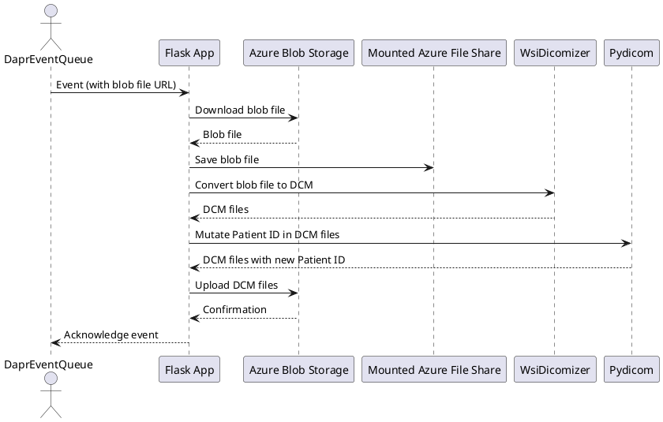
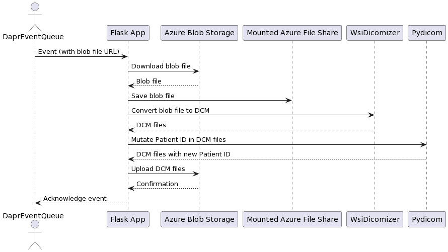

# Pathology ETL
## Overview 




## Prerequisites
- Python 3.6+
- Azure CLI
- Azure Storage Account
- Azure Container App


## Setup

```bash
export LOCATION=canadacentral
export RESOURCE_GROUP=pathology-poc # assume all resources are in the same resource group
export CONTAINERAPP_NAME=dicom-etl
export AZURE_FILE_SHARE_NAME_MOUNT=dicom-etl
export INPUT_STORAGE_ACCOUNT=ndpi
export INPUT_STORAGE_CONTAINER=input
export OUTPUT_STORAGE_ACCOUNT=dcmoutput
export OUTPUT_STORAGE_CONTAINER=output
export IMAGE_URL=tomqwu/dicom-etl-dapr:0.1.20
```


```bash
./deploy_infra.sh
./deploy_app.sh
```

## Usage

drop files into input container